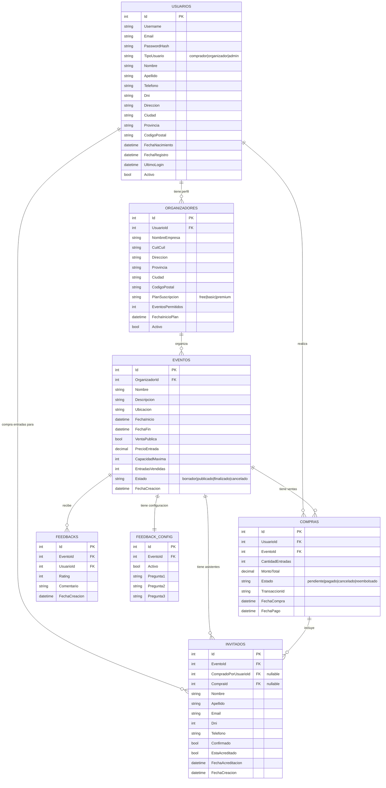

# Análisis y Plan de Refactorización - Arquitectura Limpia

**Fecha**: 10 de Octubre 2025
**Objetivo**: Profesionalizar la arquitectura siguiendo principios SOLID y separación de responsabilidades

---

## 🔍 Problemas Detectados

### 1. **AuthController con CRUD de Usuarios**
**Archivo**: `Controllers/AuthController.cs`

**Problemas**:
- ❌ Líneas 25-112: Registro de usuarios con lógica de negocio en el controller
- ❌ Líneas 114-160: Login con acceso directo a `_context`
- ❌ Líneas 163-271: CRUD completo de usuarios (GET, PUT, DELETE)
- ❌ Acceso directo a `DbContext` (línea 16: `private readonly DbHotelContext _context`)
- ❌ Creación de `Organizador` en el controller (líneas 74-93)
- ❌ Hash de contraseñas en el controller (línea 54)

**Solución**:
- ✅ Mover TODO el CRUD de usuarios a `UserController`
- ✅ Mover lógica de registro/login a `UserService`
- ✅ `AuthController` solo debe orquestar, NO tener lógica de negocio
- ✅ Eliminar `_context` del `AuthController`

---

### 2. **DTOs sin sufijo DTO consistente**

**Archivos con DTO correcto**:
- ✅ `Domain/Dtos/LoginDTO.cs`
- ✅ `Domain/Dtos/RegistroDTO.cs`
- ✅ `Domain/Dtos/UpdateUserDTO.cs`
- ✅ `Domain/Dtos/AccreditStatusDto.cs`

**Archivos SIN sufijo DTO**:
- ❌ `Domain/Dtos/PublicGuestRegistration.cs` → debería ser `PublicGuestRegistrationDTO.cs`

**Solución**:
- ✅ Renombrar todos los DTOs con sufijo `DTO`
- ✅ Crear DTOs faltantes para responses (ej: `UserResponseDTO`, `EventResponseDTO`)

---

### 3. **Entidades sin Repository-Service-Controller completo**

| Entidad | Repository | Service | Controller | Estado |
|---------|-----------|---------|------------|--------|
| **User** | ✅ | ✅ | ⚠️ Vacío | **INCOMPLETO** |
| **Guest** | ❌ | ❌ | ❌ | **NO EXISTE** |
| **EventModel** | ✅ | ✅ | ✅ | **COMPLETO** |
| **Compra** | ✅ | ✅ | ✅ | **COMPLETO** |
| **Organizador** | ❌ | ❌ | ❌ | **NO EXISTE** |
| **FeedbackModel** | ✅ | ✅ | ✅ | **COMPLETO** |
| **FeedbackConfigModel** | ❌ | ❌ | ❌ | **NO EXISTE** |

**Solución**:
- ✅ Crear `GuestRepository` + `IGuestRepository`
- ✅ Crear `GuestService` + `IGuestService`
- ✅ Crear `GuestController` (o unificar con `ListController`)
- ✅ Crear `OrganizadorRepository` + `IOrganizadorRepository`
- ✅ Crear `OrganizadorService` + `IOrganizadorService`
- ✅ Crear `OrganizadorController`
- ⚠️ Evaluar si `FeedbackConfigModel` necesita su propia triada o se maneja desde `FeedbackService`

---

### 4. **Controllers innecesarios o mal nombrados**

| Controller | Propósito Actual | Estado | Acción |
|-----------|------------------|--------|--------|
| `PingController` | Health check | ⚠️ | Mantener pero renombrar a `HealthController` |
| `MiControladorProtegido` | Testing auth | ❌ | **ELIMINAR** (solo para pruebas) |
| `ListController` | Maneja `Guest` | ⚠️ | Renombrar a `GuestController` |
| `AuthController` | Auth + CRUD User | ❌ | **REFACTORIZAR** (solo Auth) |
| `UserController` | Vacío | ⚠️ | **IMPLEMENTAR** CRUD |

---

### 5. **Modelo Guest con campos legacy**

**Archivo**: `Domain/Guest.cs`

**Problemas**:
- ❌ Campos sin sentido: `DayOne`, `DayTwo`, `DayThree`
- ❌ Campo `Mail` debería ser `Email`
- ❌ Campo `Acreditado` debería ser `bool`
- ❌ Campo `CantEntradas` no tiene sentido (un guest = 1 entrada)
- ❌ Campos poco usados: `InfoAdicional`, `Profesion`, `Cargo`, `Empresa`, `Lugar`, `RedSocial`

**Solución**:
- ✅ Limpiar campos innecesarios
- ✅ Renombrar `Mail` → `Email`
- ✅ Cambiar `Acreditado` (int) → `EstaAcreditado` (bool)
- ✅ Eliminar `DayOne`, `DayTwo`, `DayThree`
- ✅ Mantener solo: `Id`, `Nombre`, `Apellido`, `Email`, `Dni`, `Telefono`, `EventoId`, `CompradoPorUsuarioId`, `CompraId`, `EstaAcreditado`, `FechaAcreditacion`, `Confirmado`

---

## 📊 Diagrama de Base de Datos Actual



---

## 🎯 Plan de Refactorización (Priorizado)

### FASE 1: Limpieza de AuthController ⭐⭐⭐ URGENTE
1. Mover CRUD de usuarios a `UserController`
2. Mover lógica de registro a `UserService.Register()`
3. Mover lógica de login a `UserService.Login()`
4. `AuthController` solo orquesta, sin `_context`

### FASE 2: Modelo Guest ⭐⭐⭐ URGENTE
1. Limpiar campos legacy de `Guest`
2. Crear migración para eliminar columnas
3. Renombrar `Mail` → `Email`
4. Cambiar `Acreditado` → `EstaAcreditado` (bool)

### FASE 3: Completar triada Guest ⭐⭐
1. Crear `GuestRepository` + interfaz
2. Crear `GuestService` + interfaz
3. Refactorizar `ListController` → `GuestController`
4. Mover lógica de `ListService` a `GuestService`

### FASE 4: Triada Organizador ⭐⭐
1. Crear `OrganizadorRepository` + interfaz
2. Crear `OrganizadorService` + interfaz
3. Crear `OrganizadorController`
4. Mover lógica de creación de organizador desde `AuthController`

### FASE 5: Estandarización DTOs ⭐
1. Renombrar `PublicGuestRegistration` → `PublicGuestRegistrationDTO`
2. Crear `UserResponseDTO`
3. Crear `EventResponseDTO`
4. Crear `CompraResponseDTO`

### FASE 6: Limpieza de Controllers ⭐
1. Eliminar `MiControladorProtegido`
2. Renombrar `PingController` → `HealthController`
3. Verificar que ningún controller acceda directo a `_context`

### FASE 7: Actualizar Documentación
1. Actualizar `CLAUDE.md` con arquitectura real
2. Crear diagrama de flujo de cada endpoint
3. Documentar convenciones de nombres

---

## 📐 Convenciones Finales

### Nomenclatura
- **Entidades**: Sin sufijos (`User`, `Guest`, `EventModel`)
- **DTOs**: Sufijo `DTO` (`LoginDTO`, `UserResponseDTO`)
- **Interfaces Repository**: Prefijo `I` + `Repository` (`IUserRepository`)
- **Interfaces Service**: Prefijo `I` + `Service` (`IUserService`)
- **Controllers**: Sufijo `Controller` (`UserController`)

### Estructura de Carpetas
```
/Domain
  ├── User.cs
  ├── Guest.cs
  ├── EventModel.cs
  ├── Compra.cs
  ├── Organizador.cs
  ├── FeedbackModel.cs
  └── /Dtos
      ├── LoginDTO.cs
      ├── RegistroDTO.cs
      ├── UserResponseDTO.cs
      └── ...

/Repository
  ├── /Interfaces
  │   ├── IUserRepository.cs
  │   └── ...
  └── /Impl
      ├── UserRepository.cs
      └── ...

/Services
  ├── /Interfaces
  │   ├── IUserService.cs
  │   └── ...
  └── /Impl
      ├── UserService.cs
      └── ...

/Controllers
  ├── AuthController.cs (solo login/registro/logout)
  ├── UserController.cs (CRUD usuarios)
  ├── GuestController.cs (CRUD invitados)
  ├── EventController.cs
  ├── CompraController.cs
  └── ...
```

### Flujo de Request
```
Request
  ↓
[Controller] ← Orquesta, valida input, retorna response
  ↓
[Service] ← Lógica de negocio, validaciones complejas
  ↓
[Repository] ← Acceso a datos (único lugar con _context)
  ↓
[DbContext] ← Entity Framework
  ↓
[Database]
```

---

## ✅ Checklist Final

Antes de dar por terminado el refactor:

- [ ] Ningún controller tiene `_context` inyectado
- [ ] Todos los DTOs tienen sufijo `DTO`
- [ ] Cada entidad tiene su Repository-Service-Controller
- [ ] No hay código de testing en producción
- [ ] Guest limpiado (sin campos legacy)
- [ ] CLAUDE.md actualizado con arquitectura real
- [ ] Diagrama de BD documentado
- [ ] Todos los endpoints documentados con su flujo

---

**Next Steps**: Empezar con FASE 1 - Refactorizar AuthController
